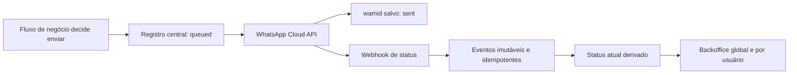

# Acompanhamento de entregas de templates WhatsApp

**Data:** 2026-08-07
**Status:** desenho aprovado para implementação
**Repositórios:** `frontend` e `backoffice`

## Objetivo

Permitir que a equipe acompanhe, pelo Backoffice, o ciclo de entrega dos templates oficiais outbound enviados pela Automatize: aceito pela Meta, entregue, lido ou falho.

O acompanhamento terá uma página global e uma aba dentro do detalhe de cada usuário. A primeira versão é somente leitura.

## Escopo

Entram no acompanhamento:

- `signup_nudge_15m_v2`;
- `signup_nudge_1d_v2`;
- `trial_onboarding_nudge_30m_v1`;
- `pix_renovacao_v2`;
- `pix_pagamento_confirmado_v1`;
- futuros templates oficiais que utilizarem o mesmo envio rastreado.

Não entram:

- mensagens recebidas dos clientes;
- respostas livres do Mat ou da Eve;
- conversas do assistente no WhatsApp;
- mensagens manuais de suporte;
- conteúdo da mensagem ou payload bruto da Meta;
- ações de reenvio, atendimento ou alteração de campanha.

## Arquitetura escolhida

As tabelas atuais de onboarding e cobrança continuam responsáveis pela elegibilidade, deduplicação e decisão de envio. Uma nova camada central registra somente o acompanhamento operacional dos templates.

### `whatsapp_template_deliveries`

Um registro por tentativa lógica de envio de template:

- `id`;
- `user_id` obrigatório;
- `template_name` e `language_code`;
- `source` e `source_delivery_id`, ligando ao registro de onboarding ou cobrança;
- `provider_message_id` (`wamid`) único quando existir;
- `current_status`: `queued`, `sent`, `delivered`, `read`, `failed` ou `deleted`;
- `current_status_at`, baseado no horário informado pelo provedor;
- `accepted_at`, `delivered_at`, `read_at`, `failed_at` e `deleted_at`;
- `failure_code` e `failure_detail` sanitizados;
- `historical_status_untracked` para envios anteriores à captura dos callbacks;
- `created_at` e `updated_at`.

Restrições e índices:

- unicidade de `(source, source_delivery_id)` para impedir duplicação do mesmo envio lógico;
- unicidade de `provider_message_id` quando preenchido;
- índices para usuário/data, template/data, status/data e `provider_message_id`;
- nenhum telefone, corpo da mensagem ou payload do provedor será duplicado nessa tabela.

`source` e `template_name` serão strings controladas pela aplicação, não enums de banco, para que novos templates não exijam mudança estrutural.

### `whatsapp_template_status_events`

Registro imutável de cada callback aceito:

- `id`;
- `delivery_id`, nulo enquanto o envio ainda não tiver sido correlacionado;
- `provider_message_id`;
- `provider_status`;
- `provider_status_at`;
- erro sanitizado quando houver;
- `created_at`.

A chave idempotente será formada pelos campos estáveis do evento, incluindo `provider_message_id`, status, horário do provedor e código de erro. Repetições do mesmo callback não gerarão linhas ou atualizações duplicadas.

## Envio rastreado

Todos os call sites de templates oficiais passarão por uma função central de envio rastreado. Ela exigirá `userId`, template, origem e identificador do registro de origem.

O fluxo será:

1. A tabela de origem faz a decisão e claim idempotente que já realiza hoje.
2. O envio rastreado cria ou reutiliza a entrega central em `queued`.
3. Se a Meta aceitar a requisição, salva o `wamid`, `accepted_at` e `sent`.
4. Se a requisição ao provedor falhar, salva `failed` e somente o erro sanitizado.
5. A tabela de origem mantém seu status atual e não passa a depender da tabela central para elegibilidade.

Isso será aplicado aos workflows de pré-trial e trial, ao cron de renovação PIX, à confirmação de pagamento PIX e ao script de backfill de ativação. Envios livres do Mat continuarão usando o cliente atual sem criar entregas de template.

## Captura do webhook

O endpoint atual continuará verificando `X-Hub-Signature-256` antes de interpretar o corpo. Além das mensagens inbound já processadas, ele passará a extrair os blocos `statuses`.

Para eventos de status:

- a gravação idempotente no banco ocorre antes da resposta `200`;
- falha transitória de banco retorna erro para que a Meta possa reenviar o callback;
- o evento é associado pelo `provider_message_id`;
- se o callback chegar antes de o envio salvar o `wamid`, o evento permanece sem `delivery_id` e é reconciliado assim que a entrega for atualizada;
- eventos recebidos fora de ordem não rebaixam o status atual.

O status atual será derivado pelo maior `provider_status_at`. Em empate, a precedência determinística será `deleted`, `failed`, `read`, `delivered`, `sent`. Os timestamps de cada etapa permanecem registrados mesmo quando o status atual avança.

## Histórico anterior

Será criado um script paginado com `--dry-run` e `--apply` que importa as entregas conhecidas das tabelas de onboarding e cobrança.

- Os 158 envios de ativação já identificados fazem parte desse conjunto.
- O script não fixa o número 158: ele inclui também envios oficiais ocorridos depois daquele levantamento.
- Envios aceitos são importados como `sent` com `historical_status_untracked=true`.
- Falhas históricas que existirem nas tabelas de origem podem ser importadas como `failed`, com erro sanitizado.
- O script é idempotente por origem e identificador da entrega.
- Não será inventado status de entrega ou leitura que não foi capturado na época.

## Backoffice

### Permissão

Será criada a permissão `whatsapp:view`, concedida inicialmente somente aos papéis `admin` e `dev`. A rota global e a aba do usuário verificarão essa permissão no servidor.

Consultores de marketing, financeiro e demais papéis não verão a navegação nem poderão abrir as páginas diretamente.

### Página global `/whatsapp`

A navegação lateral ganhará o item **WhatsApp**. A página será server-rendered, paginada e baseada em parâmetros de URL.

Estado inicial:

- últimos 7 dias;
- todos os templates;
- todos os status;
- 50 registros por página, do mais recente para o mais antigo.

Filtros:

- período;
- template;
- status atual;
- busca por nome ou e-mail do usuário.

Indicadores:

- **Enviados:** entregas com `accepted_at`, inclusive as que avançaram para entregue, lido ou falho posteriormente;
- **Entregues:** entregas com `delivered_at` ou `read_at`;
- **Lidos:** entregas com `read_at`;
- **Falhos:** entregas com `failed_at`;
- **Sem rastreamento posterior:** entregas históricas com a flag correspondente.

A tabela mostrará usuário, template, origem, horário do envio, status atual, horário da última atualização e motivo sanitizado da falha. O usuário será um link para a aba WhatsApp do seu detalhe.

Não haverá botões de reenvio ou outras mutações.

### Aba WhatsApp do usuário

O hub do usuário ganhará a aba **WhatsApp**, disponível apenas para quem possuir `whatsapp:view`.

A aba exibirá, do mais recente para o mais antigo:

- nome amigável e nome técnico do template;
- origem do disparo;
- sequência visual `enviado → entregue → lido`;
- timestamps de cada etapa;
- falha sanitizada quando aplicável;
- marcador “Status posterior não rastreado” para o histórico importado.

Essa aba não se mistura com a aba **Conversas**, que continua responsável pelas interações do Mat/Eve.

## Privacidade e manutenção

- O Backoffice pode exibir nome e e-mail já existentes do usuário, mas não persistirá nova cópia desses dados nas tabelas de monitoramento.
- O payload bruto, o texto do template e o telefone não serão armazenados.
- Erros serão reduzidos a código e detalhe operacional sanitizado, sem token, cabeçalho ou destinatário.
- A rotina existente de exclusão de usuário será atualizada para remover eventos e entregas na ordem correta.
- Logs de aplicação usarão IDs internos e códigos; não incluirão número de telefone ou payload completo.

## Testes

### Frontend

- parser de `statuses` válidos e desconhecidos;
- verificação de assinatura mantida;
- callback duplicado;
- eventos fora de ordem;
- falha com erro sanitizado;
- callback que antecede o salvamento do `wamid` e posterior reconciliação;
- envio aceito, rejeitado e sem configuração;
- cobertura dos cinco templates oficiais pelo envio rastreado;
- backfill em dry-run, apply e repetição idempotente.

### Backoffice

- RBAC de `whatsapp:view` para admin/dev e bloqueio dos demais papéis;
- normalização dos filtros;
- agregação dos indicadores;
- paginação e busca por usuário;
- consulta da timeline de um usuário;
- semântica de histórico não rastreado e falhas.

A interface reutilizará os componentes existentes de tabela, badge, card e paginação. Não será criada uma nova linguagem visual para o Backoffice.

## Migração e rollout

1. Criar migration aditiva e schema autoritativo no `frontend`; espelhar as tabelas no schema do `backoffice`.
2. Publicar em staging a captura do webhook e o envio rastreado.
3. Enviar um template oficial para número interno e confirmar `sent → delivered → read` no banco.
4. Publicar as telas do Backoffice em staging e validar página global, filtros e aba do usuário.
5. Rodar o backfill com `--dry-run`, revisar contagens por template/origem e depois executar `--apply`.
6. Executar testes focados, typecheck/lint aplicáveis e `git diff --check`. Não executar build.
7. Publicar primeiro o `frontend`, confirmar migration e webhook; depois publicar o `backoffice`.
8. Fazer um canário em produção com um template oficial enviado para conta interna e confirmar os estados posteriores no Backoffice.

Em caso de falha, os deployments podem ser restaurados. A migration aditiva permanece aplicada; como as tabelas são somente de monitoramento, elas não alteram elegibilidade, pagamento, acesso ou créditos.

## Fora desta iniciativa

- caixa de entrada de WhatsApp;
- acompanhamento das respostas do Mat/Eve;
- atendimento humano;
- reenvio manual;
- criação ou edição de templates na Meta;
- reconstrução de `delivered` ou `read` para callbacks antigos que já foram descartados.

## Baseline conhecido

Antes desta implementação, `bun test` no `backoffice` apresentou 183 testes passando e uma falha preexistente em `lib/mercadopago/pix-errors.test.ts`, causada por divergência entre a mensagem esperada e a mensagem atual. Essa falha não pertence ao escopo deste trabalho e deve permanecer separada da verificação do acompanhamento WhatsApp.
